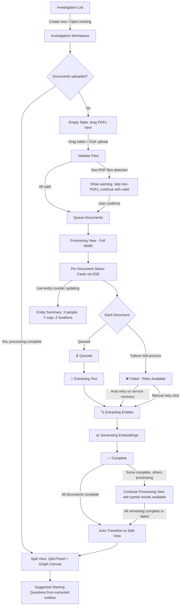
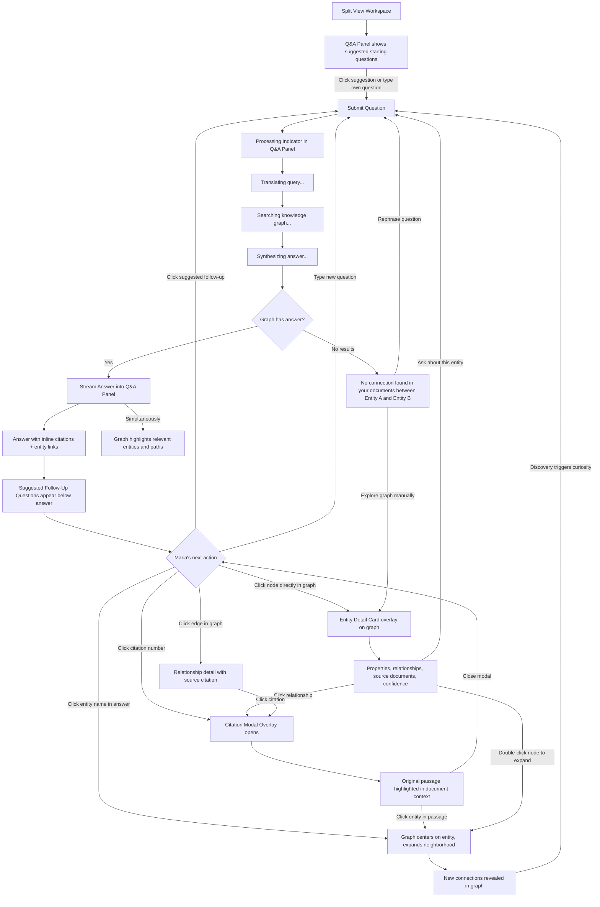
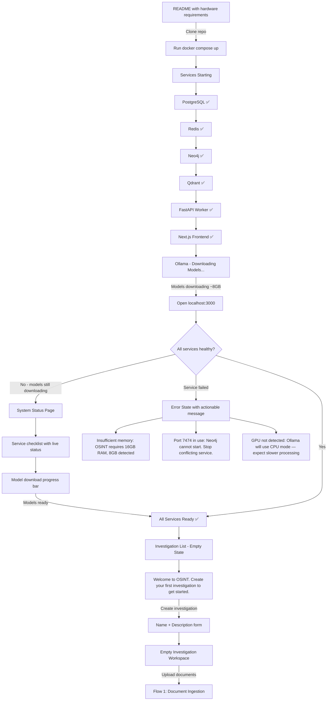

# UX Design Specification OSINT

**Author:** Gennadiy
**Date:** 2026-03-06

---

## Executive Summary

### Project Vision

OSINT is a local-first investigation platform where journalists upload documents, the system automatically extracts entities and relationships using local LLMs, and investigators explore connections through a knowledge graph and natural language Q&A. The core UX principle: every fact is traceable to its original document passage, and the Q&A experience serves as a launchpad into deeper graph exploration — not a terminal destination.

### Target Users

**Primary: Maria — Independent Investigative Journalist**
Non-technical, time-pressured, protecting confidential sources. Her core pain is finding hidden connections across large document sets while maintaining a traceable chain of evidence. She works solo with no technical support. After getting an answer from the system, she explores more connections — the investigation deepens, it doesn't end.

**Secondary: Carlos — Local Police Detective**
Similar investigation needs to Maria, with additional requirements for evidence documentation suitable for prosecutors. Operates on air-gapped department workstations.

**Setup: Alex — Data Journalist**
More technical user who evaluates and deploys the tool. Comfortable with Docker and terminal. Her experience defines the onboarding path.

### Key Design Challenges

1. **Graph complexity at scale** — Investigations can produce hundreds of entities. The graph must be explorable without overwhelming non-technical users. Progressive disclosure is essential — start with high-connectivity hubs, expand on demand.
2. **Source citation trust loop** — Product credibility depends entirely on the citation click-through experience. Investigators must be able to quickly verify any fact against its original document passage to trust the system enough to publish or prosecute.
3. **Processing patience** — Local LLM processing on consumer hardware takes real time. The UX must keep investigators informed and engaged during document ingestion, showing meaningful progress rather than opaque loading states.

### Design Opportunities

1. **Answer-to-graph exploration flow** — Q&A responses serve as guided entry points into the graph. Every entity and connection in an answer is clickable, expanding into visual exploration. The answer is a launchpad, not a dead end.
2. **Evidence-first graph interactions** — Every graph edge shows its source citation. Every node shows which documents mention it. The graph is a navigable evidence map, not abstract data visualization — directly differentiating from tools like Maltego and i2.
3. **Investigation momentum loop** — Ask, see answer, click entity, see connections, ask follow-up, go deeper. A tight exploration loop designed to keep investigators in a state of discovery rather than requiring them to context-switch between tools.

## Core User Experience

### Defining Experience

The core experience of OSINT is the **ask-explore loop**: the investigator asks a natural language question, receives a grounded answer with citations, and then explores the connections revealed — clicking entities, expanding neighborhoods, discovering paths they didn't know existed. This loop is the product. Everything else (upload, processing, setup) exists to enable it.

The most frequent user action is asking natural language questions and exploring the answers. The graph visualization is not a separate mode — it is the visual manifestation of the answer, the space where discovery happens after the question is asked.

### Platform Strategy

- **Desktop web application** served at localhost via Docker Compose
- **Mouse/keyboard primary** — minimum 1280px viewport, no mobile/tablet
- **Fully offline after setup** — no internet required during investigation
- **Browser-based** (Chrome, Firefox, Safari latest) — no native app installation beyond Docker
- **Consumer hardware** — 16GB RAM, 8GB VRAM minimum. Performance must be acceptable on a journalist's laptop, not just a developer's workstation.

### Effortless Interactions

- **Question to answer** — Typing a question and getting a cited response should feel instant and natural. No query syntax, no mode selection, no configuration. Just ask.
- **Answer to graph** — Entities in the answer are directly clickable into the graph. No copy-paste, no "switch to graph view," no manual search. The answer IS the entry point to visual exploration.
- **Citation verification** — Clicking a source citation shows the original passage immediately in context. One click, zero navigation.
- **Document ingestion** — Drag a folder, see progress per document, come back to a populated knowledge graph. No file-by-file upload, no format configuration, no preprocessing steps.
- **Exploration continuation** — After expanding a node's neighborhood, asking a follow-up question about what was just revealed should require no context-setting. The system knows what the investigator is looking at.

### Critical Success Moments

1. **The unknown connection** (make-or-break) — The first time the graph reveals a connection the investigator didn't know existed. This is the moment that proves the tool's value beyond what spreadsheets and manual reading can deliver. If this moment doesn't happen in the first session, the tool fails.
2. **The cited answer** — The first time the investigator asks a question and gets a multi-hop answer with source citations. This proves the system understands the documents.
3. **The verified source** — The first time the investigator clicks a citation and sees the exact passage in the original document. This establishes trust.
4. **The second question** — After the first answer, the investigator immediately asks a follow-up. This confirms the ask-explore loop is working — they're in flow, not evaluating.

### Experience Principles

1. **Ask first, graph second** — The natural language query is the primary interface. The graph is the answer's visual form, not a separate mode. Users think in questions, not in nodes.
2. **Zero friction from question to discovery** — The path from typing a question to seeing an unexpected connection in the graph should feel like a single continuous motion, not a sequence of tool-switching steps.
3. **The graph reveals, not displays** — The graph's job isn't to show everything at once. It's to surface what the investigator didn't know to ask about. Hub nodes, unexpected paths, and clusters that weren't in any single document.
4. **Every discovery is provable** — Delight comes from finding a hidden connection. Trust comes from clicking through to the source passage. Both must be immediate — no discovery without proof, no proof that requires effort.

## Desired Emotional Response

### Primary Emotional Goals

**Empowered and in control.** Maria is the investigator. OSINT is her instrument. The tool amplifies her capabilities — it doesn't replace her judgment. She decides what to ask, where to explore, what to trust. The system serves her investigation, never drives it.

**Confident revelation.** The combination of seeing something she couldn't see before AND knowing she can prove it. Revelation without confidence is a hallucination. Confidence without revelation is a search engine. OSINT delivers both simultaneously — every discovered connection is immediately verifiable.

### Emotional Journey Mapping

| Stage | Desired Feeling | Design Implication |
|-------|----------------|-------------------|
| **First launch** | Clarity, low intimidation | Clean interface, obvious first action (create investigation, upload documents) |
| **Document upload** | Anticipation, confidence it's working | Real-time per-document progress, entity counts appearing live |
| **First question** | Curiosity, ease | Natural language input, no syntax to learn, just type what you'd ask a colleague |
| **First answer** | Revelation + trust | Multi-hop answer with inline citations, each fact clickable to source |
| **Graph exploration** | Empowered discovery | Clicking entities expands the picture; the investigator controls the pace |
| **Citation click-through** | Verification satisfaction | Instant passage display, exact source context, zero ambiguity |
| **Error / failure** | Informed, not alarmed | Transparent explanation of what happened, what's affected, what to do next |
| **Return visit** | Continuity, momentum | Investigation state exactly as left, ready to pick up the thread |

### Micro-Emotions

**Trust vs. Skepticism (critical priority)** — Trust is the foundation. If Maria doubts a single connection, she doubts the entire system. Every design decision must build trust: source citations on every fact, confidence indicators on every entity, transparent processing status, honest "no connection found" responses. Trust is not a feature — it's the product's survival condition.

**Confidence vs. Confusion (high priority)** — Maria should always know where she is, what the system is doing, and what she can do next. No ambiguous states, no hidden modes, no mystery about what the graph is showing her.

**Excitement vs. Anxiety (moderate priority)** — The ask-explore loop should generate investigative excitement, not tool anxiety. Complexity is revealed progressively — Maria never faces an overwhelming wall of data. She expands what she wants to see, when she wants to see it.

### Design Implications

- **Trust → Citation ubiquity** — No fact appears anywhere in the UI without a source citation. Answers, entity cards, relationship edges, graph tooltips — everything links back to source documents. Citation is not a feature of Q&A; it's a property of every piece of information the system surfaces.
- **Empowerment → User-initiated actions** — The system never takes autonomous action on the investigation. It processes what's uploaded, answers what's asked, shows what's clicked. The investigator drives. The system responds.
- **Transparency → Honest error states** — When OCR fails, show the raw output and explain why extraction quality is low. When a query returns nothing, say "No connection found in your documents" — not silence, not a suggestion. When Ollama crashes, show which documents were affected and offer retry. Never hide failure behind vague messages.
- **Revelation → Progressive graph disclosure** — Don't show everything at once. Start with the answer's entities, let Maria expand outward. The graph grows as her understanding grows. Each expansion is a mini-revelation — a new node she didn't expect, a path she didn't know existed.

### Emotional Design Principles

1. **The investigator is always right** — The tool presents evidence; the investigator decides what it means. No ranked results, no "likely" connections, no system opinions. The user's judgment is supreme.
2. **Trust is earned one citation at a time** — Every interaction either builds or erodes trust. There is no neutral. Design every element to be verifiable.
3. **Transparency over comfort** — When things fail, be honest and specific. Investigators deal in facts — they respect transparency and distrust polish that hides problems.
4. **Progressive revelation, never overwhelming** — Information appears when the investigator is ready for it. The graph starts simple and grows with the investigation. Complexity is available, never imposed.

## UX Pattern Analysis & Inspiration

### Inspiring Products Analysis

**Maltego — Graph Investigation Platform**

Maltego establishes the model of graph-as-investigation-workspace: entities are visual objects, relationships are visible edges, and the graph IS the investigation. Its progressive graph building through transforms — run a query, see results appear as new connected nodes — is the core interaction pattern for investigation tools. However, Maltego's UX fails non-technical users: transforms are an opaque technical concept, the graph becomes visually chaotic at scale with no intelligent layout or progressive disclosure, and the enterprise UI density creates a steep learning curve incompatible with time-pressured journalists.

**Perplexity — AI Search with Citations**

Perplexity demonstrates the gold standard for cited Q&A: ask a natural language question, receive a well-structured answer with numbered inline citations, each clickable to its source. The answer reads like a research brief, not a database result. Follow-up questions are completely frictionless — just keep typing. However, Perplexity treats the answer as a terminal artifact. There's no way to visually explore the relationships within the answer, no graph view, no "expand this entity" interaction. The answer is informative but not explorable.

### Transferable UX Patterns

**From Perplexity — Adopt directly:**
- **Inline numbered citations** — Facts in answers get superscript citation numbers, clickable to source. This is the trust mechanism. OSINT adapts this for local documents rather than web sources.
- **Conversational follow-up** — After an answer, the input is immediately ready for the next question. No mode-switching, no "new query" button. The conversation continues.
- **Answer-as-brief format** — Structured prose with clear factual statements, not bullet-point database results. Reads like a research assistant's report.

**From Maltego — Adapt for accessibility:**
- **Graph-as-workspace** — The investigation lives in the graph. But unlike Maltego, OSINT enters the graph through Q&A answers rather than through technical "transforms." The graph grows from questions, not from menu selections.
- **Entity expansion** — Click a node to reveal its connections. Maltego does this through right-click transform menus. OSINT simplifies to: double-click a node, its neighbors appear. No menu, no transform selection, no configuration.
- **Visual relationship mapping** — Edges between nodes show relationship types. Maltego labels edges but makes them hard to read at scale. OSINT should use edge thickness/color for relationship type and click-to-inspect for details.

**Novel combination — OSINT's unique pattern:**
- **Answer-to-graph bridge** — Perplexity's cited answer format + Maltego's graph workspace, connected. Entities in the Perplexity-style answer are clickable nodes that place you into a Maltego-style graph view centered on that entity. This pattern doesn't exist in either product.

### Anti-Patterns to Avoid

1. **Maltego's transform complexity** — Never expose the user to query mechanics. No "select transform," no "configure parameters," no technical vocabulary. The user asks a question in plain language. Period.
2. **Maltego's graph chaos** — Never render hundreds of nodes simultaneously without structure. Progressive disclosure always. Smart layout that clusters related entities. The graph should clarify, never overwhelm.
3. **Maltego's enterprise UI density** — No toolbars with 40 icons. No nested menus. No configuration panels visible by default. The investigation interface should feel closer to a clean document than to an enterprise dashboard.
4. **Perplexity's dead-end answers** — Never present an answer as a terminal artifact. Every answer must be a doorway into deeper exploration. Every entity and relationship mentioned must be explorable.
5. **Generic loading states** — Neither Maltego nor Perplexity handle long processing well. OSINT must show meaningful progress (per-document status, entity counts updating live) rather than spinners or progress bars without context.

### Design Inspiration Strategy

**Adopt (use directly):**
- Perplexity's inline citation format with numbered superscript references
- Perplexity's conversational follow-up pattern (always ready for next question)
- Maltego's concept of graph-as-investigation-workspace

**Adapt (modify for OSINT's users):**
- Maltego's entity expansion — simplified from transform menus to double-click
- Maltego's relationship visualization — cleaner, with click-to-inspect rather than label clutter
- Perplexity's answer format — extended with clickable entity names that bridge into graph view

**Invent (doesn't exist yet):**
- Answer-to-graph bridge — the cited answer dissolves into a graph view where each mentioned entity is a node the investigator can expand
- Evidence-first graph — every edge in the graph is a clickable citation, not just a line connecting nodes

**Avoid:**
- Technical vocabulary or query configuration (Maltego's transforms)
- Unstructured graph rendering at scale (Maltego's visual chaos)
- Enterprise UI density (Maltego's toolbars and panels)
- Terminal answers without exploration paths (Perplexity's dead ends)

## Design System Foundation

### Design System Choice

**shadcn/ui + Tailwind CSS** — Themeable, composable component primitives with utility-first styling.

shadcn/ui provides unstyled, accessible component primitives (built on Radix UI) that are copied directly into the project — owned, not imported. Tailwind CSS provides the styling layer with utility classes. Together they offer a clean, minimal foundation that can be customized without fighting framework opinions.

### Rationale for Selection

1. **Solo developer speed** — shadcn/ui components are production-ready with built-in accessibility (keyboard navigation, ARIA attributes, focus management) from Radix UI. No time spent building basic UI primitives from scratch during an 8-week MVP.
2. **Full customization control** — OSINT's core interfaces (Q&A answer panel, citation viewer, graph overlay controls, entity detail cards) don't exist in any component library. shadcn/ui's "copy and own" model means standard components (buttons, dialogs, inputs) work out of the box while custom components use the same styling patterns without framework conflicts.
3. **Dark mode native** — Investigation tools demand dark theme support. Tailwind's dark mode utilities + shadcn/ui's CSS variable theming make dark-first design trivial. No theme provider gymnastics.
4. **Minimal visual footprint** — shadcn/ui's default aesthetic is clean and understated — closer to a professional tool than an enterprise dashboard. This aligns directly with the anti-pattern of avoiding Maltego's UI density.
5. **Cytoscape.js compatibility** — Tailwind's utility classes and shadcn/ui's unstyled approach mean no CSS conflicts with Cytoscape.js's canvas-based rendering. The graph lives in its own rendering context; UI overlays (entity cards, controls, filters) layer on top without style collisions.

### Implementation Approach

**Component Strategy:**

| Component Type | Approach | Examples |
|---------------|----------|----------|
| **Standard UI** | shadcn/ui directly | Buttons, inputs, dialogs, dropdowns, tooltips, tabs |
| **Layout** | Tailwind utilities | Page structure, panels, responsive grid, spacing |
| **Data display** | shadcn/ui + custom | Tables (document list), cards (entity detail), badges (entity types) |
| **Investigation-specific** | Fully custom on Tailwind | Q&A answer panel, citation viewer, graph controls, processing progress |
| **Graph visualization** | Cytoscape.js + custom overlays | Graph canvas, node/edge styling, overlay panels |

**Theming:**
- CSS custom properties (variables) for color tokens — enables dark/light switching
- Dark theme as default — investigation context, reduced eye strain for long sessions
- Neutral color palette with accent colors reserved for entity types (people, organizations, locations) and confidence indicators

### Customization Strategy

**What stays default:**
- shadcn/ui component behavior (accessibility, keyboard interactions, focus trapping)
- Tailwind's utility class system and responsive breakpoints
- Radix UI's underlying accessibility primitives

**What gets customized:**
- Color palette — investigation-appropriate dark theme with entity-type color coding
- Typography — optimized for reading dense factual content (answers, citations, entity properties)
- Spacing and density — tighter than shadcn/ui defaults for information-rich panels, generous for the graph workspace
- Animation — minimal and purposeful. Graph transitions (node expansion, layout shifts) get smooth animation. Standard UI interactions stay instant. No decorative motion.

**Custom components to build (not in any library):**
- **Answer Panel** — Perplexity-style cited prose with clickable entity names and superscript citation numbers
- **Citation Viewer** — Side panel or overlay showing original document passage with highlighted text
- **Graph Controls** — Filter bar (entity types, documents), zoom controls, layout toggle
- **Entity Detail Card** — Properties, relationships, source documents, confidence score — all in a compact panel overlaying the graph
- **Processing Dashboard** — Per-document status cards with real-time progress via SSE
- **Investigation Sidebar** — Investigation list, document list, entity count summary

## Defining Experience

### The One-Line Experience

"Ask a question about your documents and discover connections you didn't know existed — with proof."

This is the interaction Maria describes to her colleague at another newsroom. Not "it builds a knowledge graph" or "it does entity extraction." She says: "I uploaded my documents, asked how the mayor was connected to that company, and it showed me a path through three shell companies I'd never heard of — with citations to the exact pages."

### User Mental Model

**What Maria brings:** Maria's mental model is "a research assistant who has read all my documents." She doesn't think in graphs, nodes, or entities. She thinks in questions: "How is X connected to Y?", "Who benefits from this deal?", "What did we find about this company?" She expects to ask questions and get answers — like talking to a colleague who has photographic memory of every document.

**The graph as revelation, not input:** Maria doesn't approach the graph as a tool to operate. She approaches it as a map that appears in response to her questions. She didn't ask to see a graph — she asked a question, and the answer included a visual map of connections. The graph earns its place by showing her something she couldn't see in the text alone.

**Source verification as instinct:** As a journalist, Maria's reflex when seeing a claim is "where does this come from?" The citation click-through maps directly to her existing mental model — it's how she already thinks about facts. The system doesn't need to teach her to verify; it needs to make verification instant.

**Current workaround:** Spreadsheets with columns for "Person," "Company," "Connection," "Source Document," "Page." This works for 20 entries. It collapses at 200. Maria knows the connections are in her documents — she just can't hold enough relationships in her head to see the pattern.

### Success Criteria

| Criteria | Metric | Rationale |
|----------|--------|-----------|
| **Question to answer** | First cited answer within 30 seconds of asking | The system must feel responsive, not like a batch job |
| **Unknown connection revealed** | At least one non-obvious multi-hop path surfaced per investigation | This is the value proposition — if the system only shows what Maria already knows, it's useless |
| **Citation verification** | One click from any fact to original passage | Trust requires zero-friction verification |
| **Follow-up momentum** | Investigator asks second question within 60 seconds of first answer | Proves the ask-explore loop is working |
| **Graph comprehension** | Maria can explain what the graph is showing within 10 seconds of seeing it | The graph must be immediately readable, not a puzzle to decode |

### Novel UX Patterns

**Pattern: Answer-to-Graph Bridge (Novel)**

This interaction doesn't exist in any current product. It combines Perplexity's cited answer format with Maltego's graph workspace in a persistent split view:

- Left panel: Q&A conversation with cited, prose-format answers. Entity names are highlighted and clickable. Citation numbers are superscript and clickable.
- Right panel: Interactive graph showing extracted entities and relationships. Always visible, always reflecting the current investigation state.
- The bridge: clicking an entity name in the left panel centers and highlights that entity in the right panel's graph, expanding its neighborhood. The two panels are synchronized — the answer narrates what the graph shows.

**Pattern: Graph-First Landing (Adapted from Maltego)**

When Maria opens a processed investigation, she sees the graph immediately — not an empty state waiting for a question. The graph shows the top hub entities (most connected nodes) with a clean layout. This gives her orientation: "here's what the system found in your documents." The Q&A input sits ready below or beside the graph, inviting her first question.

**Pattern: Conversational Investigation (Adapted from Perplexity)**

The Q&A panel maintains conversation history within a session. Each answer builds on the previous context. Maria doesn't re-explain what she's looking for — she refines: "What about before 2022?" or "Show me the money trail." The system maintains investigation context across questions.

### Experience Mechanics

**1. Initiation — Opening the Investigation**

- Maria opens her investigation from the investigation list
- The workspace loads in split view: graph (right) showing top hub entities with clean force-directed layout, Q&A panel (left) with input field and optional suggested starting questions based on extracted entities
- The graph is immediately populated — entities extracted during processing are visible as colored nodes (people = blue, organizations = green, locations = amber)
- Entity count summary visible: "23 people, 14 organizations, 8 locations, 67 relationships"

**2. Interaction — The Ask-Explore Loop**

- Maria types a question in natural language: "How is Deputy Mayor Horvat connected to GreenBuild LLC?"
- The system shows a brief processing indicator (translating query, searching graph, synthesizing answer)
- The answer streams into the left panel as Perplexity-style cited prose: "Deputy Mayor Horvat is connected to GreenBuild LLC through two paths: (1) Horvat signed contract award #2024-089 awarded to GreenBuild LLC [1], and (2) Horvat's brother-in-law Marko Petrovic is registered director of Cascade Holdings, which owns 60% of GreenBuild LLC [2][3]."
- Simultaneously, the graph on the right animates to highlight the relevant entities and paths — Horvat, GreenBuild LLC, Cascade Holdings, Marko Petrovic — with the connection paths visually traced
- Entity names in the answer are highlighted links. Citation numbers are superscript links.

**3. Feedback — Trust and Discovery Signals**

- Each citation number in the answer maps to a source: "[1] contract-award-089.pdf, page 3". Clicking it opens the citation viewer showing the exact passage with highlighted text.
- Clicking an entity name in the answer (e.g., "Cascade Holdings") centers the graph on that entity and expands its neighborhood — revealing other connections Maria hasn't asked about yet. This is the discovery moment.
- The graph animates smoothly during focus changes — nodes rearrange, new neighbors appear, the layout stabilizes. The animation communicates "the system is showing you more" rather than "the screen is changing randomly."
- Confidence indicators appear subtly: entity nodes have a border thickness proportional to extraction confidence. Low-confidence entities are visually distinct without being alarming.

**4. Completion — The Investigation Continues**

- There is no "completion" in the traditional sense. The ask-explore loop is continuous. Each answer leads to more questions. Each graph expansion reveals more connections.
- The Q&A input is always ready for the next question. No "new query" action needed.
- Maria's session ends when she decides to stop — not when the system runs out of things to show. Investigation state persists exactly as left for the next session.
- When the graph cannot answer a question: "No connection found in your documents between [Entity A] and [Entity B]." Clear, honest, specific. Not "I don't know" — the system names exactly what it looked for and didn't find.

## Visual Design Foundation

### Color System

**Theme: Warm Dark — "Investigator's Desk"**

The color system evokes a warm, grounded workspace — like a journalist's desk late at night. Dark warm neutrals as the foundation, with semantic accent colors that carry meaning (entity types, confidence levels, status indicators). The warmth makes extended investigation sessions comfortable without the cold, clinical feel of typical intelligence tools.

**Base Palette (Dark Theme — Default):**

| Token | Role | Value | Usage |
|-------|------|-------|-------|
| `--bg-primary` | Main background | `#1a1816` | Page background, graph canvas |
| `--bg-secondary` | Panel background | `#232019` | Q&A panel, sidebars |
| `--bg-elevated` | Cards, overlays | `#2d2a23` | Entity cards, citation viewer, dialogs |
| `--bg-hover` | Interactive hover | `#38342b` | List items, buttons on hover |
| `--border-subtle` | Dividers, borders | `#3d3830` | Panel separators, card borders |
| `--border-strong` | Active borders | `#5c5548` | Focused inputs, selected items |
| `--text-primary` | Main text | `#e8e0d4` | Body text, answers, entity names |
| `--text-secondary` | Supporting text | `#a89f90` | Labels, metadata, timestamps |
| `--text-muted` | Tertiary text | `#7a7168` | Placeholders, disabled text |

**Entity Type Colors (Semantic — consistent everywhere):**

| Entity Type | Color | Token | Rationale |
|-------------|-------|-------|-----------|
| People | Soft blue | `#6b9bd2` / `--entity-person` | Universally associated with people/profiles |
| Organizations | Muted green | `#7dab8f` / `--entity-org` | Growth, structure, institutional |
| Locations | Warm amber | `#c4a265` / `--entity-location` | Maps, earth, geographic warmth |

These colors appear on graph nodes, entity badges in answers, filter controls, and entity detail cards. Consistent color = instant recognition without reading labels.

**Status & Feedback Colors:**

| Status | Color | Token | Usage |
|--------|-------|-------|-------|
| Success / Complete | `#7dab8f` | `--status-success` | Processing complete, healthy services |
| Warning / Low confidence | `#c4a265` | `--status-warning` | Low extraction confidence, degraded service |
| Error / Failed | `#c47070` | `--status-error` | Processing failed, service down |
| Info / Active | `#6b9bd2` | `--status-info` | Processing in progress, active query |
| Citation link | `#9b8ec4` | `--citation-link` | Superscript citation numbers, source links |

**Light Theme (Secondary — available but not default):**
- Inverted value scale with warm white backgrounds (`#faf8f5`)
- Same entity type and status colors, adjusted for light background contrast
- Available via toggle for users who prefer light mode or daytime use

### Typography System

**Font Strategy: Readable Editorial**

The typography prioritizes readability for dense factual prose. The Q&A answer panel contains the most-read text in the application — multi-sentence answers with inline citations that Maria needs to read carefully, evaluate, and decide whether to trust. This demands a typeface optimized for sustained reading, not just scanning.

**Primary Typeface: Source Serif 4 (Variable)**
- Used for: Q&A answers, citation passages, document text preview
- Why: Serif typeface with excellent screen rendering. Designed for editorial content. The slight warmth of serifs matches the warm color palette and makes dense factual prose feel like a research brief rather than a database dump. Variable font keeps bundle size small.

**Secondary Typeface: Inter (Variable)**
- Used for: UI elements, labels, graph node labels, entity card properties, navigation, buttons, metadata
- Why: Clean, neutral sans-serif designed for screens. High legibility at small sizes (graph labels, metadata). Industry standard — shadcn/ui's default, so zero configuration.

**Type Scale (based on 16px base):**

| Token | Size | Line Height | Weight | Usage |
|-------|------|-------------|--------|-------|
| `--text-xs` | 11px | 1.4 | 400 | Graph node labels, fine metadata |
| `--text-sm` | 13px | 1.5 | 400 | Entity card properties, timestamps, status text |
| `--text-base` | 15px | 1.6 | 400 | Q&A answers, citation passages, body text |
| `--text-lg` | 17px | 1.5 | 500 | Entity names in cards, section labels |
| `--text-xl` | 20px | 1.4 | 600 | Investigation title, panel headers |
| `--text-2xl` | 24px | 1.3 | 600 | Page titles (investigation list, dashboard) |

**Font Pairing Rules:**
- Source Serif 4 only in reading contexts: answer panel, citation viewer, document text
- Inter everywhere else: navigation, labels, buttons, graph, cards, forms
- Never mix typefaces within a single text block
- Citation superscript numbers use Inter (monospaced feel for numbers) even within Source Serif prose

### Spacing & Layout Foundation

**Spacing Scale (4px base unit):**

| Token | Value | Usage |
|-------|-------|-------|
| `--space-1` | 4px | Tight spacing: between icon and label, inline badge padding |
| `--space-2` | 8px | Component internal padding: button padding, input padding |
| `--space-3` | 12px | Between related elements: list item gaps, card section spacing |
| `--space-4` | 16px | Standard component spacing: between cards, form fields |
| `--space-6` | 24px | Section spacing: between content blocks within a panel |
| `--space-8` | 32px | Panel padding: internal padding of major panels |
| `--space-12` | 48px | Major section gaps: between page sections |

**Layout Strategy: Context-Aware Density**

The workspace uses two density modes simultaneously:

- **Breathable density** for the Q&A panel — generous line height (1.6), comfortable paragraph spacing, reading-optimized margins. Maria reads answers carefully; the text needs room to breathe.
- **Efficient density** for the graph workspace, entity cards, and data panels — tighter spacing, compact cards, information-dense layouts. Investigation data benefits from having more visible at once without scrolling.

**Primary Layout: Split View Investigation Workspace**

```
┌──────────────────────────────────────────────────────────┐
│  Investigation Header (title, doc count, entity count)   │
├────────────────────┬─────────────────────────────────────┤
│                    │                                     │
│   Q&A Panel        │         Graph Canvas                │
│   (left, ~35%)     │         (right, ~65%)               │
│                    │                                     │
│   ┌──────────────┐ │    ┌─────────────────────────────┐  │
│   │ Answer with   │ │    │                             │  │
│   │ citations     │ │    │    Interactive Graph         │  │
│   │ and entity    │ │    │    (Cytoscape.js)           │  │
│   │ links         │ │    │                             │  │
│   └──────────────┘ │    │                             │  │
│                    │    └─────────────────────────────┘  │
│   ┌──────────────┐ │    ┌──────────┐                    │
│   │ Ask a         │ │    │ Filters  │  Entity Detail    │
│   │ question...   │ │    └──────────┘  (overlay card)   │
│   └──────────────┘ │                                     │
├────────────────────┴─────────────────────────────────────┤
│  Status Bar (service health, processing status)          │
└──────────────────────────────────────────────────────────┘
```

- Split view divider is resizable (drag to adjust Q&A vs. graph proportion)
- Default split: 35% Q&A panel / 65% graph canvas
- Graph canvas takes more space — it's the primary discovery surface
- Q&A panel scrolls independently — conversation history grows vertically
- Entity detail card appears as an overlay on the graph canvas when a node is clicked
- Citation viewer appears as a slide-out panel from the right edge (over the graph) or as a bottom sheet

**Secondary Layouts:**

- **Investigation List** — Full-width card grid. Each investigation card shows name, document count, entity count, last accessed date.
- **Processing View** — Full-width during initial document upload. Per-document status cards in a vertical list with real-time progress updates. Transitions to split view once processing completes and graph is populated.

### Accessibility Considerations

**Contrast Ratios (WCAG AA target for MVP):**
- Primary text on primary background: minimum 7:1 (`#e8e0d4` on `#1a1816` = ~11:1)
- Secondary text on primary background: minimum 4.5:1 (`#a89f90` on `#1a1816` = ~5.5:1)
- Entity type colors on dark backgrounds: all above 4.5:1 for text, 3:1 for graphical elements
- Citation link color distinguishable from surrounding text without relying solely on color (underline on hover)

**Non-Color Indicators:**
- Entity types identified by shape (circle = person, diamond = org, triangle = location) in addition to color — supports colorblind users
- Confidence levels shown by border thickness, not just color
- Processing status uses icons + text + color, never color alone
- Graph edges use dash patterns per relationship type as secondary indicator alongside color

**Focus Management:**
- Keyboard navigation through Q&A conversation (Tab through citations, Enter to open)
- Graph keyboard navigation deferred to post-MVP (complex Cytoscape.js integration)
- All shadcn/ui components maintain default keyboard accessibility
- Focus ring visible on all interactive elements (warm-tinted focus ring matching color palette)

## Design Direction Decision

### Design Directions Explored

Six directions were generated and evaluated through an interactive HTML showcase (`ux-design-directions.html`):

- **A: Balanced Workspace** — 35/65 split, classic layout
- **B: Prose-Forward** — 40/60 split, wider Q&A, richer reading experience
- **C: Graph-Dominant** — Full-screen graph with floating Q&A overlay
- **D: Focused Investigation** — Icon sidebar with minimal chrome
- **E: Tabbed Workspace** — Tab navigation with mode separation
- **F: Narrative Drawer** — Full graph with bottom pull-up drawer

### Chosen Direction

**Direction B: Prose-Forward** — 40/60 split with wider Q&A panel, editorial typography, and suggested follow-up questions.

The investigation workspace is a persistent split view:
- **Left panel (40%)** — Q&A conversation with Source Serif 4 typography at 16px/1.8 line height. Generous spacing for reading comfort. Inline entity links and superscript citations. Suggested follow-up questions appear after each answer to maintain investigation momentum.
- **Right panel (60%)** — Interactive graph canvas (Cytoscape.js). Entity nodes colored by type, highlighted paths synchronized with the current answer. Entity detail cards overlay the graph on node click. Filter chips at the bottom for entity type filtering.
- **Header** — Investigation title with entity count summary
- **Status bar** — Service health indicators and processing status

### Design Rationale

1. **Reading is the core trust mechanism.** Maria reads the answer before she trusts it. A wider Q&A panel with editorial typography gives her the reading experience she needs to evaluate each fact and decide whether to follow up. The answer isn't a notification — it's a research brief that deserves reading space.
2. **Suggested follow-ups maintain momentum.** After each answer, the system proposes relevant follow-up questions based on the entities and relationships mentioned. This keeps Maria in the ask-explore loop without requiring her to formulate every question from scratch — especially powerful when the system reveals entities she didn't know to ask about.
3. **60% graph is still generous.** The graph loses only 5% compared to the balanced layout but the Q&A panel gains significant readability. The graph remains the primary discovery surface with full Cytoscape.js interaction, entity overlays, and filter controls.
4. **Synchronized panels.** Both panels are always visible. When Maria asks a question, the answer streams into the left panel while the graph highlights relevant entities and paths on the right. Clicking an entity name in the answer centers and expands that entity in the graph. The two panels tell the same story in different modalities — text and visual.
5. **Low build complexity.** A CSS grid split view with resizable divider is straightforward to implement. No z-index layering issues, no gesture handling, no additional navigation state. Fastest path to MVP.

### Implementation Approach

**Layout Structure:**
```
┌──────────────────────────────────────────────────────────┐
│  Investigation Header (title, entity counts)             │
├──────────────────────┬───────────────────────────────────┤
│                      │                                   │
│   Q&A Panel (40%)    │       Graph Canvas (60%)          │
│                      │                                   │
│   ┌────────────────┐ │   ┌───────────────────────────┐   │
│   │ Answer with    │ │   │                           │   │
│   │ rich citations │ │   │   Interactive Graph        │   │
│   │ and entity     │ │   │   (Cytoscape.js)          │   │
│   │ links          │ │   │                           │   │
│   └────────────────┘ │   │         Entity Detail     │   │
│                      │   │         (overlay card)     │   │
│   Suggested follow-  │   └───────────────────────────┘   │
│   up questions       │   ┌──────────┐                    │
│                      │   │ Filters  │                    │
│   ┌────────────────┐ │   └──────────┘                    │
│   │ Ask a follow-  │ │                                   │
│   │ up question... │ │                                   │
│   └────────────────┘ │                                   │
├──────────────────────┴───────────────────────────────────┤
│  Status Bar (service health, processing status)          │
└──────────────────────────────────────────────────────────┘
```

**Key Implementation Details:**
- Resizable split divider (drag to adjust proportions, default 40/60)
- Q&A panel uses Source Serif 4 at 16px with 1.8 line height
- Graph panel uses Inter for all labels and overlays
- Suggested follow-up questions generated from answer entities — clickable to ask
- Citation viewer slides out from right edge over the graph panel
- Processing view is full-width (no split) during initial document ingestion, transitions to split view when complete

## User Journey Flows

### Flow 1: Document Ingestion & Processing

**Goal:** Maria goes from zero to a populated knowledge graph ready for investigation.

**Entry point:** Maria creates a new investigation or opens an existing one and uploads documents.



**Key design decisions:**
- **Full-width processing view** during ingestion — no split view yet, there's no graph to show. The processing view IS the experience at this stage.
- **Live entity counter** — As each document completes, the entity summary updates in real-time ("23 people, 14 organizations..."). This builds anticipation and shows the system is producing value.
- **Auto-transition** — When all documents finish processing (or all remaining are failed), the workspace smoothly transitions to the split view with graph populated and suggested starting questions visible. No manual step required.
- **Partial failure resilience** — Failed documents are clearly marked with retry option. Successfully processed documents and their entities are immediately available. The investigation isn't blocked by individual document failures.

### Flow 2: Ask-Explore Loop (Core Interaction)

**Goal:** Maria asks questions, gets cited answers, explores the graph, and follows leads — the defining experience loop.

**Entry point:** Split view workspace with populated graph and Q&A panel.



**Key design decisions:**
- **Three-phase processing indicator** — "Translating → Searching → Synthesizing" keeps Maria informed without technical jargon. She knows the system is working, not frozen.
- **Synchronized panels** — The answer streams into the left panel while the graph simultaneously highlights the relevant subgraph on the right. Both panels tell the same story.
- **Three exploration branches from every answer:**
  1. Click entity name → graph centers and expands (discovery path)
  2. Click citation → modal overlay with source passage (verification path)
  3. Click follow-up suggestion or type new question (continuation path)
- **Citation modal overlay** — Opens over both panels, focused on the source passage. Dismissible to return to full workspace. Can also navigate to entities mentioned in the cited passage.
- **The loop is continuous** — Every action leads back to either asking another question or exploring the graph. There's no dead end.

### Flow 3: First-Run Setup & Onboarding

**Goal:** Alex deploys OSINT and reaches a working investigation workspace.

**Entry point:** README on GitHub.



**Key design decisions:**
- **System status page as gatekeeper** — If models aren't ready when Alex opens the browser, she sees a clear status page with service checklist and download progress — not a broken interface or cryptic errors.
- **Actionable error messages** — Every failure state names the problem and suggests a fix. No generic "Something went wrong."
- **Cold model warning** — First query after fresh start takes longer (model loading into memory). The processing indicator should account for this without alarming the user.

### Journey Patterns

Across these three flows, several reusable patterns emerge:

**Navigation Patterns:**
- **Progressive workspace transition** — Empty state → Processing view (full-width) → Split view workspace. The layout evolves as the investigation matures.
- **Always-ready input** — The Q&A input field is always visible and accepting input in the split view. No mode switching to ask a question.

**Decision Patterns:**
- **Suggested actions** — The system always offers a next step: suggested starting questions, follow-up questions after answers, retry for failed documents. The user never faces a blank "what now?" moment.
- **Three-branch exploration** — Every answer presents three paths: verify (citation), explore (entity click), continue (follow-up question). The user chooses their investigation style.

**Feedback Patterns:**
- **Real-time progressive status** — Document processing shows per-document phase transitions via SSE. Query processing shows three named phases. Never an opaque spinner.
- **Honest failure with recovery** — Every error state includes: what happened, what's affected, and what to do about it. Failed documents offer retry. Unavailable services show degraded mode.
- **Synchronized dual-panel feedback** — Q&A answers and graph highlights update simultaneously. The two panels are never out of sync.

### Flow Optimization Principles

1. **Minimize steps to value** — From upload to first cited answer in three actions: drag documents → wait for processing (auto-transition) → click suggested question or type own. No configuration, no settings, no mode selection.
2. **Reduce cognitive load at decision points** — Suggested follow-up questions mean Maria doesn't need to formulate every query from scratch. Entity type colors mean she doesn't need to read labels to distinguish people from organizations. Three exploration branches are surfaced, not hidden in menus.
3. **Meaningful progress indicators** — Per-document processing phases replace generic progress bars. Entity counts update live during processing. Query phases are named in plain language. The system always communicates what it's doing and why.
4. **Graceful degradation over blocking failure** — Ollama down? Graph browsing still works. Some documents failed? Successfully processed ones are available immediately. No results for a query? Name exactly what was searched and not found. The system bends but doesn't break.
5. **Continuity across sessions** — Investigation state persists exactly as left. Re-opening an investigation returns to the split view with full graph and conversation history. No re-processing, no "loading" the investigation.

## Component Strategy

### Design System Components (shadcn/ui)

Components used directly from shadcn/ui with OSINT theming applied via CSS custom properties:

| Component | Usage in OSINT | Customization |
|-----------|---------------|---------------|
| **Button** | Q&A submit, retry failed docs, create investigation | Warm dark theme tokens, entity-type color variants |
| **Input / Textarea** | Q&A question input, investigation name/description | Source Serif 4 for Q&A input, Inter for forms |
| **Dialog** | Base for Citation Modal, confirmation dialogs | Extended with custom content layout for citations |
| **Card** | Base for Entity Detail Card, Investigation Card | Custom anatomy per card type |
| **Badge** | Entity type labels, confidence indicators, status | Entity-type color variants (person/org/location) |
| **Progress** | Document processing progress per-document | Warm accent color, phase label integration |
| **ScrollArea** | Q&A conversation history, document list | Subtle warm-tinted scrollbar |
| **Tooltip** | Graph node hover preview, citation preview | Compact entity summary on graph hover |
| **Alert** | Service warnings, processing errors, no-results | Status color variants (warning/error/info) |
| **Skeleton** | Query processing phases, initial graph load | Warm-tinted skeleton matching `--bg-elevated` |
| **DropdownMenu** | Investigation actions, entity context actions | Standard shadcn/ui behavior |
| **Command** | Entity search across investigation | Filters by entity type, highlights in graph |

### Custom Components

#### Answer Panel

**Purpose:** Display Perplexity-style cited prose answers to natural language questions, with clickable entity names and superscript citation numbers.

**Anatomy:**
```
┌─────────────────────────────────┐
│  Answer text with [Entity Name] │
│  highlighted as links and       │
│  superscript citations ¹ ² ³   │
│                                 │
│  ┌─ Citation Footer ──────────┐ │
│  │ [1] contract-award.pdf, p3 │ │
│  │ [2] company-reg.pdf, p1    │ │
│  │ [3] ownership-filing.pdf   │ │
│  └────────────────────────────┘ │
│                                 │
│  Suggested Follow-Up Questions  │
│  ┌────────────────────────────┐ │
│  │ ▸ What other contracts...  │ │
│  │   Explores Horvat's full   │ │
│  │   contracting history      │ │
│  │ ▸ Who else is connected... │ │
│  │   Maps GreenBuild's full   │ │
│  │   ownership network        │ │
│  └────────────────────────────┘ │
└─────────────────────────────────┘
```

**Content:**
- Answer prose in Source Serif 4 at `--text-base` (15px) with 1.8 line height
- Entity names styled as warm-tinted links with entity-type color underline (person=blue, org=green, location=amber)
- Superscript citation numbers in Inter, styled with `--citation-link` color
- Citation footer mapping numbers to source document + page
- Suggested follow-up questions as structured list with question text (bold) and brief description (muted)

**States:**
- **Streaming** — Answer text appears progressively, word by word. Citation footer populates as citations are referenced. Skeleton placeholder for follow-up questions until answer completes.
- **Complete** — Full answer with citations and follow-up suggestions visible
- **No results** — "No connection found in your documents between [Entity A] and [Entity B]." with suggestion to rephrase or explore graph manually
- **Error** — "LLM service unavailable — try again shortly. Graph exploration still works." with retry action

**Interactions:**
- Click entity name → dispatches event to graph panel (center + expand node)
- Click citation number → opens Citation Modal
- Click citation in footer → opens Citation Modal
- Click follow-up question → submits as new question

**Accessibility:**
- Citations are `<a>` elements with `aria-label="Source: [filename], page [n]"`
- Entity links have `aria-label="Explore [entity name] in graph"`
- Follow-up questions are focusable list items, Enter to submit
- Streaming state announced via `aria-live="polite"` region

#### Citation Modal

**Purpose:** Display the original source passage from a document with the cited text highlighted in context. Opens as a modal overlay over both panels.

**Anatomy:**
```
┌─────────────────────────────────────────┐
│  ╳  Citation — contract-award-089.pdf   │
│      Page 3                             │
├─────────────────────────────────────────┤
│                                         │
│  ...preceding context in muted text...  │
│                                         │
│  ┌─ Highlighted Passage ──────────────┐ │
│  │ "Deputy Mayor Horvat signed the    │ │
│  │  contract award #2024-089 granting │ │
│  │  the municipal construction tender │ │
│  │  to GreenBuild LLC on March 15."   │ │
│  └────────────────────────────────────┘ │
│                                         │
│  ...following context in muted text...  │
│                                         │
│  [Entity Name] [Entity Name] clickable  │
├─────────────────────────────────────────┤
│  Confidence: High  │  Chunk 14 of 47   │
└─────────────────────────────────────────┘
```

**Content:**
- Document filename and page number in header
- Surrounding context (preceding and following paragraphs) in `--text-muted`
- Cited passage highlighted with `--bg-hover` background and `--text-primary` text
- Entity names within the passage are clickable (same entity link styling as Answer Panel)
- Footer shows extraction confidence and chunk position

**States:**
- **Default** — Modal open with highlighted passage and context
- **Loading** — Skeleton while passage is fetched (rare — should be near-instant from local storage)
- **Entity hover** — Entity names in passage show tooltip with entity type badge

**Interactions:**
- Close via ╳ button, Escape key, or clicking backdrop
- Click entity name in passage → closes modal, centers entity in graph
- Keyboard: Tab through entity links, Escape to close

**Accessibility:**
- Built on shadcn/ui Dialog (Radix UI) — focus trap, Escape close, `aria-modal="true"`
- Highlighted passage marked with `<mark>` element
- `aria-label="Source citation from [filename], page [n]"`

#### Entity Detail Card

**Purpose:** Display entity properties, relationships, source documents, and confidence when a graph node is clicked. Appears as a floating card near the clicked node.

**Anatomy:**
```
┌──────────────────────────────┐
│ ● Deputy Mayor Horvat   ╳   │
│   Person · High confidence   │
├──────────────────────────────┤
│ Relationships (7)            │
│  → WORKS_FOR City Council ¹  │
│  → SIGNED contract #089  ²   │
│  → KNOWS Marko Petrovic  ³   │
│  ... show more               │
├──────────────────────────────┤
│ Source Documents (4)         │
│  📄 contract-award-089.pdf   │
│  📄 council-minutes.pdf      │
│  📄 company-reg-2021.pdf     │
│  📄 ownership-filing.pdf     │
├──────────────────────────────┤
│ [Ask about this entity]      │
└──────────────────────────────┘
```

**Content:**
- Entity name with type badge (colored dot + label) and confidence indicator
- Relationship list: type → target entity, with citation superscript. Truncated at 5 with "show more"
- Source document list: documents that mention this entity
- Action button: "Ask about this entity" pre-fills Q&A input with a question about this entity

**States:**
- **Default** — Card floating near clicked node, positioned to avoid graph edges
- **Expanded** — "Show more" relationships revealed
- **Loading** — Skeleton while relationship data fetches (for entities with many connections)

**Interactions:**
- Click relationship → opens Citation Modal for that relationship's source
- Click target entity name → closes card, centers graph on target, opens new card
- Click source document → opens Citation Modal showing entity mentions in that document
- Click "Ask about this entity" → pre-fills Q&A: "What connections does [entity name] have?"
- Double-click the node (while card is open) → expand neighborhood (load connected nodes)
- Close via ╳ or clicking elsewhere on graph

**Accessibility:**
- Floating card is `role="dialog"` with `aria-label="Details for [entity name]"`
- Relationships are a list with each item focusable
- Close on Escape

#### Processing Dashboard

**Purpose:** Show real-time per-document processing progress during document ingestion. Full-width view before the investigation workspace is ready.

**Anatomy:**
```
┌──────────────────────────────────────────────────┐
│  Processing: Deputy Mayor Investigation           │
│  47 documents · 23 complete · 1 failed · 23 left │
│                                                   │
│  Entity Summary (live): 23 people, 14 orgs, 8 loc│
├──────────────────────────────────────────────────┤
│  ┌─ Document Card ─────────────────────────────┐ │
│  │ ✅ contract-award-089.pdf    Complete        │ │
│  │    3 people, 2 orgs extracted               │ │
│  └─────────────────────────────────────────────┘ │
│  ┌─ Document Card ─────────────────────────────┐ │
│  │ 🔍 council-minutes.pdf    Extracting Entities│ │
│  │    ████████░░░░░░  Phase 3 of 4             │ │
│  └─────────────────────────────────────────────┘ │
│  ┌─ Document Card ─────────────────────────────┐ │
│  │ ❌ handwritten-notes.pdf   Failed — Retry ↻ │ │
│  │    Low confidence OCR output                │ │
│  └─────────────────────────────────────────────┘ │
│  ┌─ Document Card ─────────────────────────────┐ │
│  │ ⏳ bank-records.pdf        Queued (14 of 47)│ │
│  └─────────────────────────────────────────────┘ │
└──────────────────────────────────────────────────┘
```

**Content:**
- Investigation name and overall progress summary (counts by status)
- Live entity summary counter updating as documents complete
- Per-document status cards in a scrollable vertical list
- Each card shows: filename, current phase, phase progress, extracted entity counts (when complete)

**States per document:**
- **Queued** — Waiting in queue, shows position
- **Extracting Text** — Phase 1/4, progress indicator
- **Extracting Entities** — Phase 2/4, progress indicator
- **Generating Embeddings** — Phase 3/4, progress indicator
- **Complete** — Green check, shows extracted entity counts
- **Failed** — Red indicator, error description, retry button

**Interactions:**
- Click retry on failed document → re-queues for processing
- Completed documents are clickable to preview extracted text
- Auto-transition to split view when all documents reach terminal state (complete or failed)

**Accessibility:**
- Status updates announced via `aria-live="polite"` for screen readers
- Retry button has `aria-label="Retry processing [filename]"`
- Progress phases described in text, not just icons

#### Graph Canvas

**Purpose:** Wrapper component integrating Cytoscape.js with OSINT's layout, theming, and interaction patterns. The primary discovery surface.

**Content:**
- Cytoscape.js canvas filling the right panel (60% of split view)
- Entity nodes colored by type: people (`--entity-person`), orgs (`--entity-org`), locations (`--entity-location`)
- Entity nodes shaped by type: circle (person), diamond (org), triangle (location)
- Edge labels showing relationship type, with dash pattern per type
- Node border thickness reflects confidence score

**States:**
- **Populated** — Graph showing hub entities with force-directed layout
- **Highlighting** — After a Q&A answer, relevant entities and paths glow/pulse briefly, then settle at elevated opacity while non-relevant nodes dim
- **Expanding** — Smooth animation as new neighbor nodes appear and layout stabilizes
- **Empty** — Before documents are processed: "Upload documents to populate the graph"
- **Degraded** — When Ollama is down: graph fully interactive, badge indicating "Q&A unavailable"

**Interactions:**
- Click node → Entity Detail Card (floating near node)
- Double-click node → expand neighborhood (load connected entities)
- Click edge → show relationship detail with source citation
- Hover node → tooltip with entity name, type, connection count
- Scroll → zoom in/out with level-of-detail (zoomed out: clusters; zoomed in: labels)
- Drag canvas → pan
- Drag node → reposition (sticky until layout reset)

#### Graph Controls Toolbar

**Purpose:** Collapsible toolbar at top of graph panel for filtering and layout controls.

**Anatomy (expanded):**
```
┌──────────────────────────────────────────┐
│ ▾ Filters                                │
│  [● People] [◆ Orgs] [▲ Locations]      │
│  Document: [All documents ▾]             │
│  Confidence: [All ▾]                     │
│  [Reset layout]  [Fit to view]   🔍      │
└──────────────────────────────────────────┘
```

**Content:**
- Entity type toggle chips (colored, click to show/hide)
- Document filter dropdown (filter graph to entities from specific documents)
- Confidence filter (hide low-confidence entities)
- Layout actions: reset force-directed layout, fit graph to viewport
- Entity search (Command palette trigger)

**States:**
- **Collapsed** — Single row showing active filter summary + expand chevron
- **Expanded** — Full toolbar with all filter controls visible

**Interactions:**
- Toggle entity type chips → graph instantly hides/shows entity types
- Select document filter → graph shows only entities from that document
- Click search → opens Command palette for entity search
- Click "Reset layout" → re-runs force-directed layout
- Click "Fit to view" → zooms to fit all visible nodes

#### Suggested Questions List

**Purpose:** Structured list of follow-up questions generated from the entities and relationships in the current answer. Appears below each answer in the Q&A panel.

**Anatomy:**
```
┌────────────────────────────────────┐
│ Follow-up questions                │
│                                    │
│ ▸ What other contracts did Horvat  │
│   sign?                            │
│   Explores Horvat's full contract  │
│   history across all documents     │
│                                    │
│ ▸ Who else is connected to         │
│   GreenBuild LLC?                  │
│   Maps the full ownership and      │
│   business relationship network    │
│                                    │
│ ▸ What role does Cascade Holdings  │
│   play?                            │
│   Investigates the intermediary    │
│   entity linking Horvat to         │
│   GreenBuild                       │
└────────────────────────────────────┘
```

**Content:**
- 2-4 follow-up questions per answer
- Each question has: bold question text + muted description explaining what it explores
- Questions generated from entities and relationships mentioned in the answer

**States:**
- **Loading** — Skeleton placeholder while answer is still streaming
- **Default** — Questions visible after answer completes
- **Empty** — Hidden when answer is "No connection found"

**Interactions:**
- Click question → submits as new query, scrolls Q&A to new answer
- Hover → subtle highlight on `--bg-hover`

#### System Status Page

**Purpose:** Service health dashboard shown when not all services are ready. Gatekeeper before investigation workspace.

**Anatomy:**
```
┌──────────────────────────────────────────┐
│          OSINT                            │
│  Setting up your investigation workspace │
│                                          │
│  ✅ PostgreSQL          Running          │
│  ✅ Redis               Running          │
│  ✅ Neo4j               Running          │
│  ✅ Qdrant              Running          │
│  ✅ FastAPI Worker       Running          │
│  ⏳ Ollama              Downloading models│
│     ████████░░░░  qwen2.5:7b (62%)      │
│                                          │
│  All services must be ready before       │
│  you can start investigating.            │
└──────────────────────────────────────────┘
```

**States:**
- **Initializing** — Services starting, checklist updating via SSE
- **Downloading** — Models downloading with progress
- **Ready** — All green, auto-redirects to Investigation List
- **Error** — Failed service highlighted with actionable error message

#### Investigation Card

**Purpose:** Card representing an investigation in the investigation list view.

**Anatomy:**
```
┌──────────────────────────────────┐
│  Deputy Mayor Construction       │
│  Contracts                       │
│                                  │
│  47 documents · 45 entities      │
│  67 relationships                │
│                                  │
│  Last opened: 2 hours ago        │
│                         [Delete] │
└──────────────────────────────────┘
```

**States:** Default, hover (elevated shadow), empty (no documents yet)

**Interactions:** Click → open investigation workspace. Delete button with confirmation dialog.

### Component Implementation Strategy

**Build approach:**
- All custom components built with Tailwind utility classes + OSINT CSS custom properties
- Custom components compose shadcn/ui primitives where possible (Dialog for Citation Modal, Card for Entity Detail Card, Badge for entity type labels)
- Cytoscape.js integration via React wrapper component with imperative API
- SSE integration via custom React hook (`useProcessingStream`) shared by Processing Dashboard and Graph Canvas

**Consistency rules:**
- Entity type colors are always the same everywhere: badges, graph nodes, answer entity links, filter chips
- Citation superscript numbers always use Inter + `--citation-link` color, regardless of surrounding typeface
- All modal/overlay components use shadcn/ui Dialog as base for consistent focus trapping and keyboard behavior
- Status indicators always combine icon + text + color (never color alone)

### Implementation Roadmap

**Phase 1 — Core Components (MVP-critical, needed for all journeys):**

| Component | Needed For | Priority |
|-----------|-----------|----------|
| Answer Panel | Ask-Explore Loop (Flow 2) | Highest — defines the product |
| Citation Modal | Trust verification in every flow | Highest — trust mechanism |
| Graph Canvas | Visual discovery (Flow 2) | Highest — primary discovery surface |
| Processing Dashboard | Document Ingestion (Flow 1) | High — first user experience |
| Entity Detail Card | Graph exploration (Flow 2) | High — graph without it is unreadable |

**Phase 2 — Supporting Components (enhance core experience):**

| Component | Needed For | Priority |
|-----------|-----------|----------|
| Suggested Questions List | Investigation momentum (Flow 2) | Medium — keeps loop flowing |
| Graph Controls Toolbar | Graph filtering and navigation | Medium — graph gets unwieldy without it |
| Investigation Card | Investigation management | Medium — needed but simple |

**Phase 3 — Infrastructure Components (setup and resilience):**

| Component | Needed For | Priority |
|-----------|-----------|----------|
| System Status Page | First-Run Setup (Flow 3) | Lower — only seen once per install |

## UX Consistency Patterns

### Button Hierarchy

**Primary Action** — One per visible context. The most important action the user can take right now.
- Warm-tinted solid fill on `--bg-elevated` with `--text-primary`
- Used for: "Create Investigation," Q&A submit, "Ask about this entity"
- Never more than one primary button visible in the same panel

**Secondary Action** — Supporting actions available alongside primary.
- Ghost/outline style with `--border-subtle` border, `--text-secondary`
- Used for: "Reset layout," "Fit to view," filter toggles, "Show more" relationships

**Destructive Action** — Irreversible actions that delete data.
- Ghost style with `--status-error` text, solid `--status-error` fill on hover
- Always requires confirmation dialog before executing
- Used for: "Delete Investigation," "Delete Document"
- Never placed next to primary actions without visual separation

**Tertiary/Link Action** — Inline actions within content.
- Text-only with underline on hover, colored by context (entity-type color for entity links, `--citation-link` for citations)
- Used for: entity names in answers, citation numbers, follow-up questions, relationship links in entity cards

**Icon-Only Actions** — Compact actions in space-constrained contexts.
- Always include tooltip with action name
- Always include `aria-label`
- Used for: close buttons (╳), retry (↻), expand/collapse chevrons, graph zoom controls

### Feedback Patterns

#### Toast Notifications

For background events that don't require immediate attention or user action:

- **Success toast** — Green left border (`--status-success`), icon + message, auto-dismiss after 4 seconds. Examples: "Document retry successful," "Investigation created"
- **Error toast** — Red left border (`--status-error`), icon + message + optional action button, persists until dismissed. Examples: "Document processing failed — Retry," "Service connection lost"
- **Info toast** — Blue left border (`--status-info`), icon + message, auto-dismiss after 4 seconds. Examples: "3 new entities discovered," "Model loaded"

**Position:** Bottom-right corner, stacked vertically. Maximum 3 visible — oldest dismissed when exceeded.

**Rules:**
- Toasts never interrupt the Q&A conversation or graph interaction
- Toasts are supplementary — critical state changes also update inline (e.g., document card status updates even if the toast is missed)
- All toasts are keyboard-dismissible and announced to screen readers

#### Inline Status Updates

For state changes within components that the user is actively watching:

- **Processing Dashboard** — Per-document status transitions update in-place. No toast needed — the user is watching.
- **Q&A Panel** — Query processing phases ("Translating → Searching → Synthesizing") shown inline below the input, replacing previous phase text.
- **Graph Canvas** — Service degradation badge appears in graph header. "Q&A unavailable" with status color.
- **System Status Page** — Service checklist updates in-place via SSE.

**Rule:** If the user is looking at the component, update inline. If the event happens in a different context, use a toast.

#### Confidence Indicators

Consistent visual language for extraction confidence across all components:

| Confidence | Visual | Token | Usage |
|-----------|--------|-------|-------|
| **High** | Solid border, full opacity | `--status-success` border | Default presentation — no special marking needed |
| **Medium** | Dashed border, slight opacity reduction | `--status-warning` border | Entity cards, graph nodes show dashed border |
| **Low** | Dotted border, reduced opacity, warning icon | `--status-warning` + icon | Explicit "low confidence" label visible. Graph nodes smaller. |

**Rules:**
- High confidence is the default — no indicator needed (absence = high)
- Medium and low confidence always show an indicator — never hide quality concerns
- Confidence is always inspectable — hover or click reveals why (e.g., "Extracted from low-quality OCR text")

### Navigation & Workspace Patterns

#### Workspace Transitions

The application has three workspace states that transition progressively:

```
Investigation List → Processing View → Split View Workspace
       (grid)          (full-width)        (40/60 split)
```

- **Investigation List → Processing View** — Triggered by creating investigation + uploading documents. Instant navigation, no animation.
- **Processing View → Split View** — Auto-transition when all documents reach terminal state. Smooth 400ms crossfade. Graph fades in as processing cards fade out.
- **Split View → Investigation List** — Back navigation via header breadcrumb or browser back. Instant.
- **Re-opening investigation** — Goes directly to Split View (processing already complete). No intermediate states.

#### Split View Behavior

- Default split: 40% Q&A / 60% Graph
- Resizable via drag handle on divider. Minimum 25% for either panel.
- Divider position persists per investigation (stored in local state)
- Both panels scroll independently
- Neither panel can be fully collapsed — both are always visible in the workspace

#### Panel Focus

- Keyboard focus follows user action: typing in Q&A input focuses Q&A panel; clicking graph focuses graph panel
- Active panel has no visual border distinction — the interaction itself provides context
- Tab key moves through focusable elements within the active panel. Tab at end of panel wraps to the other panel.

### Modal & Overlay Patterns

#### Modal Hierarchy

OSINT uses two overlay types with consistent behavior:

**Full Modal (Citation Modal, Confirmation Dialogs):**
- Centered overlay with backdrop dimming (`rgba(0,0,0,0.6)`)
- Max-width 640px for Citation Modal, 420px for confirmation dialogs
- Focus trapped inside modal (shadcn/ui Dialog / Radix UI)
- Close via: ╳ button, Escape key, backdrop click
- Body scroll locked while open
- Entrance: fade in 150ms. Exit: fade out 100ms.

**Floating Card (Entity Detail Card):**
- Positioned near the triggering graph node, auto-repositioned to stay within viewport
- No backdrop dimming — graph remains visible and partially interactive (pan/zoom still work)
- Close via: ╳ button, Escape key, clicking elsewhere on graph, clicking another node (replaces card)
- Does NOT trap focus — user can still interact with Q&A panel
- Entrance: scale up from 0.95 + fade in 150ms. Exit: fade out 100ms.

**Rules:**
- Never stack modals — one full modal at a time. Opening a Citation Modal from within an Entity Detail Card closes the card first.
- Modals never auto-open — always user-initiated (click citation, click node, click delete)
- Modal content is scrollable if it exceeds viewport height

#### Confirmation Dialog Pattern

For destructive actions only (delete investigation, delete document):

```
┌────────────────────────────────┐
│  Delete Investigation?         │
│                                │
│  "Deputy Mayor Construction    │
│  Contracts" and all its data   │
│  (47 documents, 45 entities,   │
│  67 relationships) will be     │
│  permanently deleted.          │
│                                │
│  [Cancel]          [Delete]    │
└────────────────────────────────┘
```

- Always names what will be deleted and quantifies the impact
- Cancel is secondary style (left). Delete is destructive style (right).
- Focus defaults to Cancel (safe option), not Delete
- Escape and backdrop click act as Cancel

### Empty & Loading States

#### Empty States

Every view has a purposeful empty state that tells the user what to do:

| View | Empty State Message | Action |
|------|-------------------|--------|
| Investigation List | "Create your first investigation to get started." | Primary button: "New Investigation" |
| Investigation Workspace (no docs) | "Drag PDF files here to start your investigation." | Drop zone with dashed border, or file picker button |
| Q&A Panel (no questions yet) | Suggested starting questions based on extracted entities | Clickable question suggestions |
| Graph Canvas (no entities) | "Upload documents to populate the graph." | Arrow/visual pointing to upload area |
| Q&A Panel (no results) | "No connection found in your documents between [A] and [B]." | Suggestion to rephrase or explore graph |

**Rules:**
- Empty states always include a clear next action — never a dead end
- Empty state text uses `--text-secondary` at `--text-lg` size, centered
- Empty state illustrations: minimal, warm-toned, not decorative — a single icon or subtle line drawing at most

#### Loading States

Skeleton loading used for predictable layouts. Spinner reserved for indeterminate waits.

| Context | Loading Pattern | Duration |
|---------|----------------|----------|
| Q&A answer streaming | Progressive text appearance (word by word) | Until answer complete |
| Query processing | Three-phase text indicator ("Translating...") | 5-30 seconds |
| Entity Detail Card | Skeleton matching card anatomy | <1 second |
| Graph initial render | Nodes fade in with staggered timing | <2 seconds |
| Citation Modal content | Skeleton matching passage layout | Near-instant |
| Investigation list | Skeleton cards in grid | <1 second |

**Rules:**
- Skeleton shapes match the final content layout exactly — no generic rectangles
- Skeletons use `--bg-elevated` with subtle pulse animation (warm-tinted)
- Processing phases show text labels, not just spinners — the user always knows what's happening
- No loading state should last more than 3 seconds without explanatory text

### Search & Filtering Patterns

#### Entity Search (Command Palette)

Triggered by: search icon in Graph Controls Toolbar, or keyboard shortcut (Cmd/Ctrl+K).

- Opens as Command component (shadcn/ui) — centered overlay with search input
- Results grouped by entity type with colored badges
- Type-ahead filtering as user types
- Select result → graph centers on entity, opens Entity Detail Card
- Escape or backdrop click to dismiss

#### Graph Filtering

Entity type and document filters in Graph Controls Toolbar:

- **Entity type chips** — Toggle on/off. Active chips show filled color, inactive show outline. Multiple can be active. All active by default.
- **Document filter** — Dropdown select. "All documents" default. Selecting a document filters graph to entities found in that document only.
- **Confidence filter** — Dropdown select. "All" / "High & Medium" / "High only". Default: "All".
- **Active filter indicator** — When any filter is non-default, collapsed toolbar shows badge with count of active filters.

**Rules:**
- Filters apply instantly — no "Apply" button. Graph animates to show/hide nodes.
- Filters are additive — entity type + document + confidence all combine.
- "Reset all filters" action visible when any filter is non-default.
- Filter state persists within session, resets on investigation re-open.

### Animation & Motion Patterns

**Principle:** Motion communicates state change, never decorates.

| Context | Animation | Duration | Easing |
|---------|-----------|----------|--------|
| Graph node expansion (new neighbors appear) | Nodes scale up from 0 + layout animates | 400ms | ease-out |
| Graph highlighting (answer entities glow) | Opacity transition + subtle pulse (2 cycles) | 600ms | ease-in-out |
| Processing view → Split view transition | Crossfade | 400ms | ease-in-out |
| Modal enter | Fade in + scale from 0.95 | 150ms | ease-out |
| Modal exit | Fade out | 100ms | ease-in |
| Toast enter | Slide in from right | 200ms | ease-out |
| Toast exit | Fade out | 150ms | ease-in |
| Filter toggle (graph nodes show/hide) | Opacity + scale | 200ms | ease-out |

**Rules:**
- All animations respect `prefers-reduced-motion` — reduced to instant state changes when enabled
- Graph layout animations are the longest (400ms) because spatial rearrangement needs time to track
- UI chrome animations are short (100-200ms) — snappy, not sluggish
- No animation on text content (answers, citations, entity properties). Text appears, it doesn't fly in.

## Responsive Design & Accessibility

### Responsive Strategy

**Platform: Desktop-only (1280px minimum)**

OSINT is a localhost application accessed on the investigator's laptop or workstation. No mobile or tablet support is required — the PRD explicitly targets desktop browsers (Chrome, Firefox, Safari latest) at minimum 1280px viewport width.

**Desktop Adaptation:**

| Viewport | Behavior |
|----------|----------|
| **1280px–1440px** (laptop) | Default experience. 40/60 split view. Graph and Q&A panels fill available space. Comfortable density at all type sizes. |
| **1441px–1920px** (external monitor) | Workspace stretches to fill. Graph canvas gains more room for larger graphs. Q&A panel line lengths remain readable via `max-width` on prose containers (65ch). |
| **1921px–2560px** (ultrawide) | Full stretch continues. Graph canvas benefits most — more visible nodes without scrolling. Q&A prose container stays at 65ch max-width to prevent uncomfortably long lines. Additional horizontal space absorbed by panel padding. |
| **2561px+** (multi-monitor/4K) | Same as ultrawide. No max-width on the overall workspace — panels stretch, prose containers stay constrained. |

**Key rules:**
- Workspace always fills 100% viewport width and height — no centered max-width container
- Q&A answer prose uses `max-width: 65ch` to maintain readability regardless of panel width
- Graph canvas always fills its panel — more space = more visible graph
- Resizable split divider respects minimum 25% per panel at any viewport width
- Entity Detail Card floating position adapts to available graph canvas space

### Breakpoint Strategy

**Single breakpoint: 1280px minimum**

No responsive breakpoints in the traditional sense. The application has a hard minimum:

```css
/* Application minimum */
min-width: 1280px;
min-height: 720px;
```

Below 1280px, the application does not reflow or adapt — content may overflow. A subtle warning appears if viewport is detected below minimum: "OSINT is designed for screens 1280px and wider."

**Internal layout adaptation (not breakpoints, but fluid behavior):**

- Split view divider position is percentage-based — works at any width above 1280px
- Graph canvas Cytoscape.js automatically fills its container at any size
- Investigation list card grid uses CSS Grid `auto-fill` with `minmax(320px, 1fr)` — adapts column count to available width
- Processing Dashboard document cards stack vertically in a scrollable list — no width adaptation needed

### Accessibility Strategy

**MVP: Best-effort accessibility foundations, formal WCAG AA compliance in v2**

The MVP targets 5 beta users in controlled outreach — not public release. Full WCAG AA compliance is formalized for v2 when the user base expands. However, the design foundations established in this specification already meet most AA criteria by default.

**What MVP delivers (already designed in):**

| WCAG Criterion | Status | Implementation |
|---------------|--------|----------------|
| **1.4.3 Contrast (AA)** | Met | Primary text: ~11:1. Secondary text: ~5.5:1. All above 4.5:1 minimum. |
| **1.4.1 Use of Color** | Met | Entity types use shape + color. Confidence uses border style + color. Status uses icon + text + color. |
| **2.1.1 Keyboard** | Partial | All shadcn/ui components keyboard-accessible. Q&A input, citations, modals all keyboard-navigable. Graph keyboard navigation deferred. |
| **2.4.7 Focus Visible** | Met | Warm-tinted focus ring on all interactive elements via shadcn/ui defaults. |
| **4.1.2 Name, Role, Value** | Met | All custom components specify `aria-label`, `role`, and state attributes as defined in Component Strategy. |
| **1.3.1 Info and Relationships** | Met | Semantic HTML. Headings for sections. Lists for relationships. `<mark>` for highlighted citations. |
| **2.4.3 Focus Order** | Met | Tab order follows visual layout. Split view panels tab sequentially. Modals trap focus. |
| **3.2.1 On Focus** | Met | No context changes on focus alone. All actions require explicit activation (click/Enter). |

**What MVP defers to v2:**

| WCAG Criterion | Gap | v2 Plan |
|---------------|-----|---------|
| **2.1.1 Keyboard (graph)** | Cytoscape.js graph canvas not keyboard-navigable | Custom keyboard navigation layer: arrow keys to traverse nodes, Enter to expand, Tab to move between graph and panels |
| **1.1.1 Non-text Content** | Graph nodes don't have text alternatives beyond tooltips | Screen reader mode that presents graph as navigable list of entities and relationships |
| **1.4.11 Non-text Contrast** | Graph edge colors may not all meet 3:1 against canvas | Audit and adjust edge colors/thickness for contrast |
| **2.4.1 Bypass Blocks** | No skip links between major regions | Add skip links: "Skip to Q&A," "Skip to Graph," "Skip to Investigation List" |
| **1.4.13 Content on Hover** | Graph tooltip dismissal may not meet criteria | Ensure tooltips persist on hover, dismissible via Escape |

**Accessibility implementation principles for MVP:**
- Use semantic HTML elements (`<nav>`, `<main>`, `<article>`, `<aside>`) for page landmarks
- All interactive elements reachable and operable via keyboard (except graph canvas internals)
- All images/icons have text alternatives
- Focus management: modals trap focus, closing modal returns focus to trigger element
- `aria-live="polite"` regions for dynamic content (streaming answers, processing status, toast notifications)
- `prefers-reduced-motion` respected — all animations reduced to instant transitions

### Testing Strategy

**MVP Testing (lightweight, developer-driven):**

| Test Type | Method | Frequency |
|-----------|--------|-----------|
| **Contrast checking** | Browser DevTools accessibility audit (Lighthouse) | Per component during development |
| **Keyboard navigation** | Manual tab-through of all flows | Per user journey, before release |
| **Screen reader basic** | VoiceOver (macOS) smoke test of Q&A and citation flows | Once before beta release |
| **Color blindness** | Chrome DevTools vision deficiency emulation | Once per entity color palette |
| **Minimum viewport** | Manual test at 1280×720 | Per layout change |
| **Large viewport** | Manual test at 2560×1440 | Per layout change |

**v2 Testing (comprehensive):**
- Automated accessibility testing in CI (axe-core via Playwright)
- Screen reader testing matrix: VoiceOver (macOS), NVDA (Windows), Orca (Linux)
- Keyboard-only navigation testing for complete user journeys including graph
- User testing with assistive technology users
- WCAG AA audit by accessibility specialist

### Implementation Guidelines

**Layout implementation:**
- Use CSS Grid for page-level layout (split view, investigation list grid)
- Use Flexbox for component-level layout (entity cards, toolbar, status bars)
- Use `dvh` (dynamic viewport height) for full-height workspace — avoids browser chrome issues
- Q&A prose container: `max-width: 65ch` with auto horizontal margins within panel
- Graph canvas: `width: 100%; height: 100%` within its grid cell — Cytoscape.js handles internal sizing

**Accessibility implementation:**
- Landmark regions: `<header>` (investigation header), `<nav>` (investigation list), `<main>` (split view workspace), `<aside>` (Q&A panel or graph panel depending on primary designation)
- Q&A panel designated as `<main>` (primary interaction), graph panel as complementary `<aside>` — reflects the prose-forward design direction
- All custom components must pass `aria-label` and `role` props as specified in Component Strategy
- Toast container: `role="status"` with `aria-live="polite"` — screen readers announce without interrupting
- Processing status updates: `aria-live="polite"` on the entity summary counter
- Citation Modal: built on Radix UI Dialog — inherits focus trap, `aria-modal`, Escape handling
- Entity Detail Card: `role="dialog"` but NOT focus-trapping (intentional — user may need to interact with Q&A panel while card is open)
